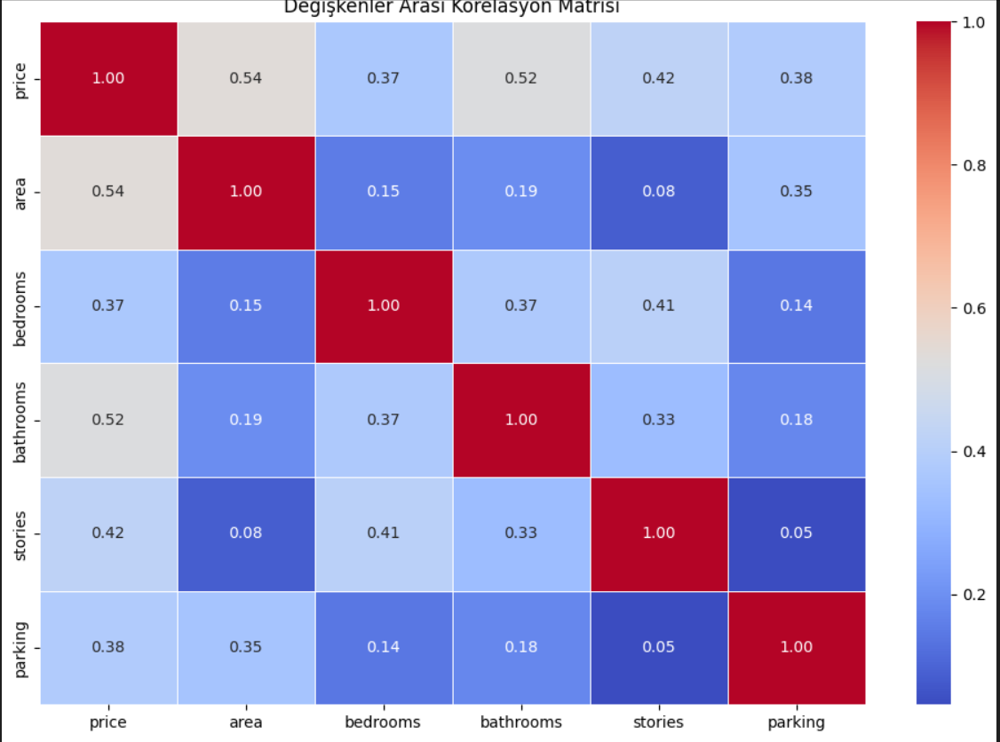
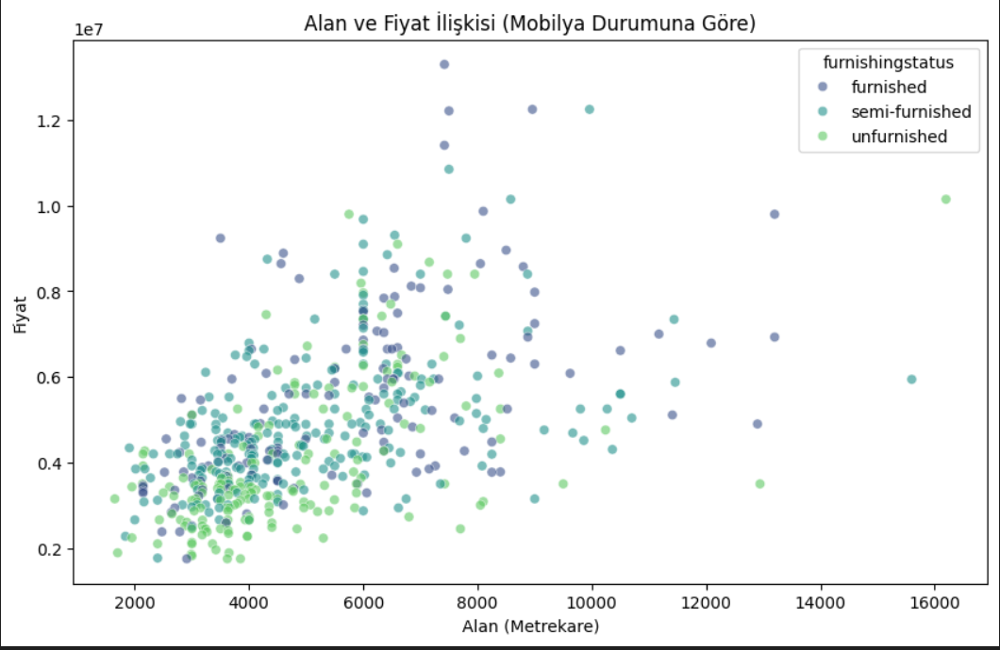
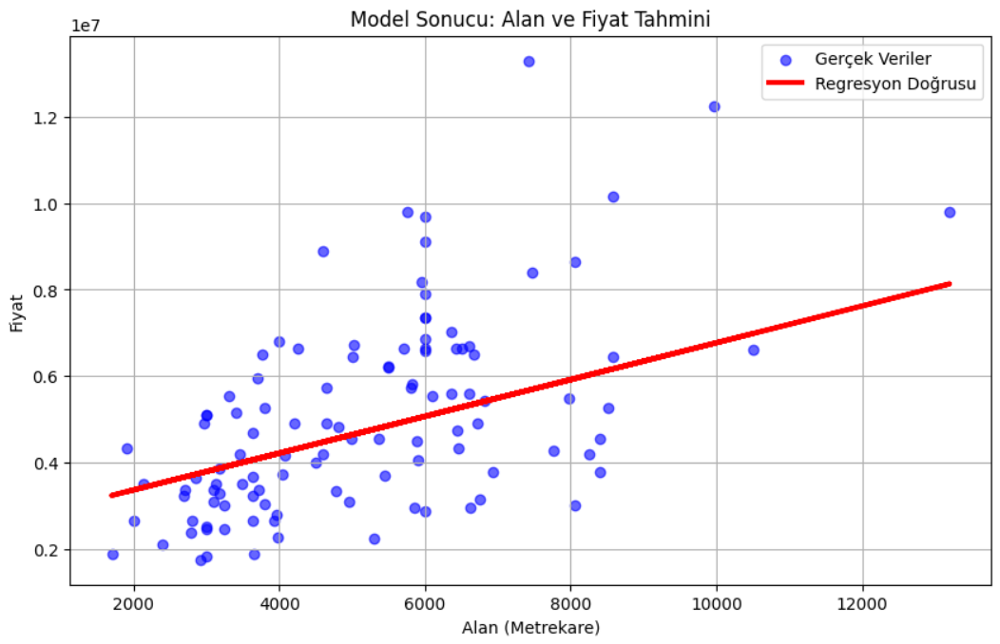

# 🏠 Ev Fiyat Tahmin Projesi (Housing Price Analysis)

  

Bu proje, makine öğrenmesi tekniklerinden **Basit Doğrusal Regresyon (Simple Linear Regression)** kullanılarak, evlerin özelliklerine göre piyasa fiyatını tahmin eden bir yapay zeka modelidir.

Amaç: Karmaşık veri setinden en anlamlı özelliği çıkarıp, fiyat üzerinde ne kadar etkili olduğunu matematiksel olarak kanıtlamaktır.

---

## 📊 1. Değişken Seçimi ve Karar Süreci (Neden Area?)

Bir evin fiyatını etkileyen onlarca faktör vardır (Oda sayısı, otopark, konum vb.). Ancak bu projede **Basit Doğrusal Regresyon** kullandığımız için hedef değişkenimiz olan `price` (Fiyat) üzerinde en baskın etkiye sahip **tek bir değişkeni** seçmemiz gerekiyordu.

Bu seçimi yapmak için **Korelasyon Matrisi (Isı Haritası)** analizini kullandık.



### ✅ Neden 'Area' (Alan) Seçildi?
Yukarıdaki Isı Haritasını incelediğimizde;
1.  **En Yüksek İlişki:** `price` satırına bakıldığında, `0.54` katsayısı ile en yüksek pozitif ilişkinin **`area`** sütununda olduğu görülmüştür.
2.  **Mantıksal Tutarlılık:** İstatistiksel verinin yanı sıra, emlak piyasası mantığında da fiyatı belirleyen birincil faktör evin büyüklüğüdür.
3.  **Sonuç:** Hem matematiksel (0.54 korelasyon) hem de sektörel mantığa dayalı olarak modelin girdisi (X) olarak **Alan** seçilmiştir.

### ❌ Diğerleri Neden Seçilmedi?
* **Bedrooms (Yatak Odası):** Korelasyonu `0.37`. İlişkisi var ama Alan kadar baskın değil. Küçük ama çok odalı evler fiyatta sapma yaratabilir.
* **Parking (Otopark):** Korelasyonu `0.38`. Fiyatı etkiliyor ancak belirleyici ana faktör değil.
* **Kategorik Veriler (Mainroad, Guestroom):** Bu veriler sayısal değil "Evet/Hayır" şeklinde olduğu için **Basit** Regresyon modeline uygun görülmemiştir (İleri seviye modellerde kullanılabilir).

---

## 📈 2. Veri Analizi ve Dağılım

Seçtiğimiz değişkenin (`area`) tutarlılığını görmek için dağılım grafiğini inceledik.



**Grafik Analizi:**
* Grafikteki noktaların **sol alttan sağ üste** doğru bir eğilim gösterdiği görülmektedir.
* Bu durum, "Metrekare arttıkça fiyat artar" hipotezimizin verilerle uyuştuğunu kanıtlar.
* Veri seti içerisinde modelin öğrenmesini zorlaştıracak aşırı dağınık (random) bir yapı yoktur.

---

## 🧹 3. Veri Ön İşleme (Preprocessing)

Ham veri seti doğrudan modele verilmemiştir. Daha sağlıklı sonuçlar almak için şu temizlik adımları uygulanmıştır:
1.  **Eksik Veri (Null) Temizliği:** `.dropna()` fonksiyonu ile boş değer içeren satırlar silinmiştir. (Boş veriler matematiksel hesaplamayı bozar).
2.  **Sütun Filtreleme:** Modelin odaklanması için sadece `area` ve `price` sütunları alınmış, diğer gürültü oluşturabilecek sütunlar veri setinden çıkarılmıştır.
3.  **Eğitim/Test Ayrımı:** Modelin ezber yapmaması için veri seti **%80 Eğitim** ve **%20 Test** olarak ikiye bölünmüştür.

---

## 🤖 4. Model Sonuçları ve Başarı

Lineer Regresyon modeli eğitildikten sonra, modelin hiç görmediği test verileri üzerinde performans ölçümü yapılmıştır.



### 📝 Sonuç Yorumu:
* **Kırmızı Regresyon Doğrusu:** Modelin öğrendiği matematiksel formülü temsil eder. Çizginin, mavi noktaların (gerçek evlerin) yoğun olduğu bölgenin tam ortasından geçmesi **modelin başarılı olduğunu** gösterir.
* **R2 Başarı Skoru:** Tek bir değişken kullanılmasına rağmen model, fiyat değişimlerini anlamlı bir oranda açıklayabilmektedir.

---

## 💻 Kurulum ve Çalıştırma

Bu projeyi kendi bilgisayarınızda çalıştırmak için:

1.  Gerekli kütüphaneleri yükleyin:
    ```bash
    pip install pandas numpy matplotlib seaborn scikit-learn
    ```
2.  `Housing.csv` dosyasının ve `.ipynb` notebook dosyasının aynı klasörde olduğundan emin olun.
3.  Notebook dosyasını çalıştırın.

---

## 👨‍💻 Geliştirici Notu
Bu çalışma, veri bilimi süreçlerinden **EDA (Keşifçi Veri Analizi), Feature Selection (Özellik Seçimi) ve Model Evaluation (Model Değerlendirme)** adımlarını uygulamalı olarak göstermek amacıyla hazırlanmıştır.
